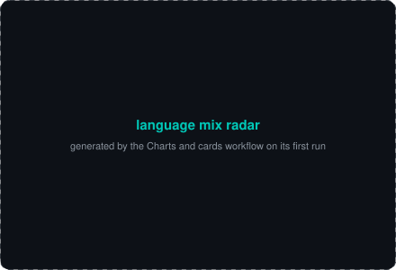
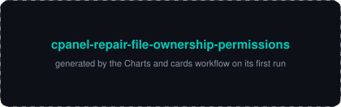
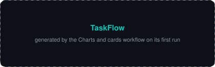
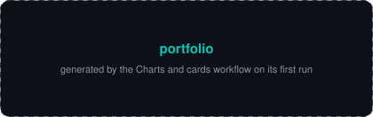
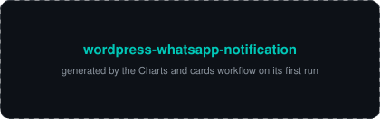
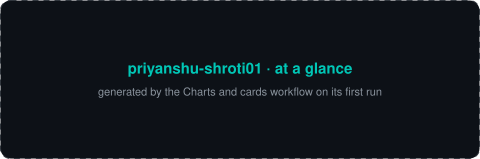
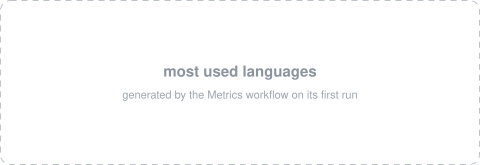

<div align="center">


<a href="https://github.com/priyanshu-shroti01">
  
</a>

</div>

### 👋 About Me

Full-stack and solutions-focused developer with hands-on experience building **production-grade SaaS platforms, automation systems, API integrations, and scalable backend workflows**. Experienced deploying and managing real-world applications across cloud and VPS environments, with a strong focus on client-oriented problem solving, workflow automation, and operational reliability.

- 💻 I work across the full stack — **React / TypeScript** on the frontend, **Node.js / Express** on the backend, **MongoDB / MySQL** for data, and **Docker / Git / Linux** for shipping it
- 🤖 I like automating things — WhatsApp/Telegram bots, cron-driven workflows, webhook-based API orchestration
- 🌍 Served **800+ clients worldwide**, across both hosting and custom development work
- 🚀 Currently working on **[cPanel File Ownership & Permissions Repair](https://github.com/priyanshu-shroti01/cpanel-repair-file-ownership-permissions)**, a tool for fixing hosting-account file/ownership issues
- 💬 Open to freelance work and full-stack opportunities — I'm hireable!
- 📫 Reach me at **priyanshushroti@gmail.com**

<br/>

### 🧰 Tech Stack

<div align="center">
  
</div>

<br/>

<table>
  <tr>
    <td valign="top" width="50%">

**Frontend**
- HTML5, CSS3, JavaScript, TypeScript
- React.js, Tailwind CSS, Bootstrap
- Responsive design

**Backend**
- Node.js, Express.js, REST APIs
- Python (foundational)
- Auth & validation, Cron jobs, Webhooks, Payment integrations

**Databases**
- MongoDB, MySQL, MongoDB Atlas

    </td>
    <td valign="top" width="50%">

**DevOps & Tools**
- Docker, Git, GitHub
- Linux, VPS, Apache, NGINX, DNS & DB management
- Netlify, Railway, PM2, Postman/API testing

**Other Experience**
- PHP, Laravel (MVC), WordPress/WooCommerce, WHMCS module development
- WhatsApp API systems, Telegram bots, workflow automation

    </td>
  </tr>
</table>

<br/>

### 📡 Skill Radar

<div align="center">

<table>
  <tr>
    <td width="50%" align="center" valign="middle">
      <!-- Self-rated radar — edit assets/skills.json, the workflow redraws it -->
      <picture>
        <source media="(prefers-color-scheme: dark)" srcset="assets/radar-dark.svg">
        <source media="(prefers-color-scheme: light)" srcset="assets/radar-light.svg">
        
      </picture>
    </td>
    <td width="50%" align="center" valign="middle">
      <!-- Live radar built from real language byte counts across my repos -->
      <picture>
        <source media="(prefers-color-scheme: dark)" srcset="assets/radar-langs-dark.svg">
        <source media="(prefers-color-scheme: light)" srcset="assets/radar-langs-light.svg">
        
      </picture>
    </td>
  </tr>
</table>

</div>

<br/>

### 📈 Impact

<div align="center">

| 🌍 Clients Served Worldwide | 💰 Hosting Revenue | 🔑 Licensing Customers | 💵 Licensing Revenue |
|:---:|:---:|:---:|:---:|
| **800+** *(Hosting & Development)* | **₹2L+** | **70+** | **₹50K+** |

</div>

<br/>

### 🚀 Featured Projects

<div align="center">

<!-- Cards generated by scripts/cards.py from assets/projects.json.
     Stars, forks and language are pulled live from the API on every run. -->
<table>
  <tr>
    <td width="50%">
      <a href="https://github.com/priyanshu-shroti01/cpanel-repair-file-ownership-permissions">
        <picture>
          <source media="(prefers-color-scheme: dark)" srcset="assets/card-cpanel-repair-file-ownership-permissions-dark.svg">
          <source media="(prefers-color-scheme: light)" srcset="assets/card-cpanel-repair-file-ownership-permissions-light.svg">
          
        </picture>
      </a>
    </td>
    <td width="50%">
      <a href="https://github.com/priyanshu-shroti01/TaskFlow">
        <picture>
          <source media="(prefers-color-scheme: dark)" srcset="assets/card-TaskFlow-dark.svg">
          <source media="(prefers-color-scheme: light)" srcset="assets/card-TaskFlow-light.svg">
          
        </picture>
      </a>
    </td>
  </tr>
  <tr>
    <td width="50%">
      <a href="https://github.com/priyanshu-shroti01/portfolio">
        <picture>
          <source media="(prefers-color-scheme: dark)" srcset="assets/card-portfolio-dark.svg">
          <source media="(prefers-color-scheme: light)" srcset="assets/card-portfolio-light.svg">
          
        </picture>
      </a>
    </td>
    <td width="50%">
      <a href="https://github.com/priyanshu-shroti01/wordpress-whatsapp-notification">
        <picture>
          <source media="(prefers-color-scheme: dark)" srcset="assets/card-wordpress-whatsapp-notification-dark.svg">
          <source media="(prefers-color-scheme: light)" srcset="assets/card-wordpress-whatsapp-notification-light.svg">
          
        </picture>
      </a>
    </td>
  </tr>
</table>

</div>

<details open>
<summary><b>🛠️ cPanel File Ownership & Permissions Repair — Active Project</b></summary>
<br/>

A hosting-admin tool that fixes broken file ownership and permission issues on cPanel accounts — restoring correct user/group ownership and standard permission modes so sites stop throwing 500/403 errors after migrations, restores, or misconfigured deployments.

`Bash` `Linux` `cPanel` `Server Administration`

🔗 [Repository](https://github.com/priyanshu-shroti01/cpanel-repair-file-ownership-permissions)
</details>

<details>
<summary><b>🗂️ TaskFlow — Full-Stack Team Task Manager</b></summary>
<br/>

Production-ready SaaS-style task management platform with JWT auth, role-based access control, and project/task tracking. Built as a full end-to-end product simulation.

`React` `Node.js` `Express` `MongoDB` `JWT` `Tailwind CSS`

🔗 [Repository](https://github.com/priyanshu-shroti01/TaskFlow)
</details>

<details>
<summary><b>💼 Portfolio — Personal Developer Portfolio</b></summary>
<br/>

Personal portfolio site built with a modern React + TypeScript stack, animated with Framer Motion and styled with Tailwind CSS.

`React` `TypeScript` `Tailwind CSS` `Vite` `Framer Motion`

🔗 [Repository](https://github.com/priyanshu-shroti01/portfolio)
</details>

<details>
<summary><b>🛒 Ethara & Golden Electronics — E-commerce Platforms</b></summary>
<br/>

Full-featured e-commerce storefronts built for real client use cases, covering product catalogs, cart flows, and order management.

`E-commerce` `Web Development`

🔗 [Ethara E-commerce](https://github.com/priyanshu-shroti01/ethara-ecommerce) · [Golden Electronics](https://github.com/priyanshu-shroti01/golden-electronics)
</details>

<details>
<summary><b>🧩 WHMCS Modules — Billing Automation Suite</b></summary>
<br/>

A collection of custom WHMCS modules built for hosting businesses: gateway fee allocation, WhatsApp order/renewal notifications, social proof widgets, and upcoming-expiry alerts.

`PHP` `WHMCS` `Module Development`

🔗 [Gateway Fees Allocator](https://github.com/priyanshu-shroti01/whmcs-gateway-fees-allocator) · [WhatsApp Notifications](https://github.com/priyanshu-shroti01/whmcs-whatsapp-notification-module) · [Social Proof](https://github.com/priyanshu-shroti01/whmcs_socialproof) · [Upcoming Expiry](https://github.com/priyanshu-shroti01/whmcs-upcoming-expiry-notification)
</details>

<details>
<summary><b>🔧 WordPress WhatsApp Notification Plugin</b></summary>
<br/>

Event-driven notification system using WordPress and WooCommerce hooks — triggers WhatsApp API calls on order status and user events, with an admin configuration panel and error handling.

`WordPress` `WooCommerce` `PHP`

🔗 [Repository](https://github.com/priyanshu-shroti01/wordpress-whatsapp-notification)
</details>

<details>
<summary><b>🖥️ ShrotiHost — Hosting Automation Platform</b></summary>
<br/>

Hosting infrastructure serving 450+ clients (including international customers) across reseller hosting and VPS environments — with automation for DNS management, client workflows, payment integrations, and WHMCS-based operational tooling. Generated ₹2L+ revenue through hosting services, custom modules, and automation-driven workflows.

`WHMCS` `VPS` `DNS` `Payment Integrations` `Client Automation`
</details>

<details>
<summary><b>🔑 CodeMarket & Licensing System — SaaS License Management</b></summary>
<br/>

Automated digital licensing and delivery platforms: **CodeMarket** serves 70+ licensed customers with API-based activation/verification (₹50K+ revenue, centralized proxy-based license routing), and a Laravel-based **Licensing System** engine handling activation, validation, expiration, and revocation via secure REST APIs, cron automation, and webhooks.

`Laravel` `REST APIs` `Webhooks` `Cron Automation` `MySQL`
</details>

<br/>

### 💼 Experience

**Ethical Hacking Intern** — LearnWik Solutions Pvt. Ltd. *(Dec 2022 – Feb 2023)*
Conducted vulnerability scanning, network analysis, and security reporting under supervision.

<br/>

### 🎓 Education

**GD Goenka University**, Gurugram — B.Tech, Computer Science & Engineering *(Sept 2022 – May 2026)*, CGPA: 7.98
**RBSM Public School** — Class 12, CBSE *(2022)*
**Gold Field Public School** — Class 10, CBSE *(2020)*

<br/>

### 📜 Certifications

- Introduction to OpenShift Applications — **Red Hat**
- Principles of Management — **NPTEL**
- Practical Cyber Security for Cyber Security Practitioners — **NPTEL**
- Best Presentation Award — Ideathon 2.1 (MSME – Govt. of India, CIE GD Goenka University)

<br/>

### 📊 GitHub Stats

<!-- Everything below is generated into this repo by GitHub Actions
     (.github/workflows/radar.yml and metrics.yml). Deliberately NOT
     github-readme-stats / streak-stats / github-profile-trophy: those are
     shared public instances that go down and take the whole section with them. -->

<div align="center">
  <picture>
    <source media="(prefers-color-scheme: dark)" srcset="assets/card-stats-dark.svg">
    <source media="(prefers-color-scheme: light)" srcset="assets/card-stats-light.svg">
    
  </picture>
</div>

<div align="center">
  
</div>

<div align="center">
  <!-- 3D isometric calendar, regenerated every 6h by .github/workflows/metrics.yml -->
  
</div>

<div align="center">
  
</div>

<div align="center">
  <!-- Snake eats the contribution graph — .github/workflows/snake.yml -->
  <picture>
    <source media="(prefers-color-scheme: dark)" srcset="https://raw.githubusercontent.com/priyanshu-shroti01/priyanshu-shroti01/output/github-contribution-grid-snake-dark.svg">
    <source media="(prefers-color-scheme: light)" srcset="https://raw.githubusercontent.com/priyanshu-shroti01/priyanshu-shroti01/output/github-contribution-grid-snake.svg">
    
  </picture>
</div>

<br/>

### 🎯 Current Focus

```yaml
role: Full-Stack Developer
focus:
  - Fixing cPanel file ownership & permission issues at scale
  - Deepening React/Node.js and system design skills
  - Building automation tooling around WHMCS & WordPress
collaborating_on: Open to freelance & full-stack opportunities
learning: Advanced backend architecture & DevOps
fun_fact: I also run hosting infrastructure on the side 🖥️
```

<br/>

<div align="center">

### 📫 Let's Connect

<a href="https://github.com/priyanshu-shroti01"></a>
<a href="https://www.linkedin.com/in/priyanshu-shroti"></a>
<a href="mailto:priyanshushroti@gmail.com"></a>

<br/><br/>


</div>
